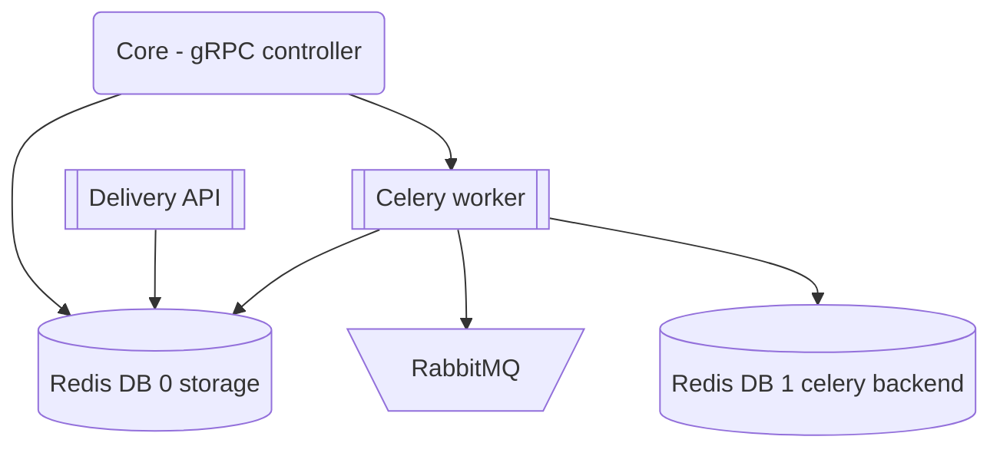
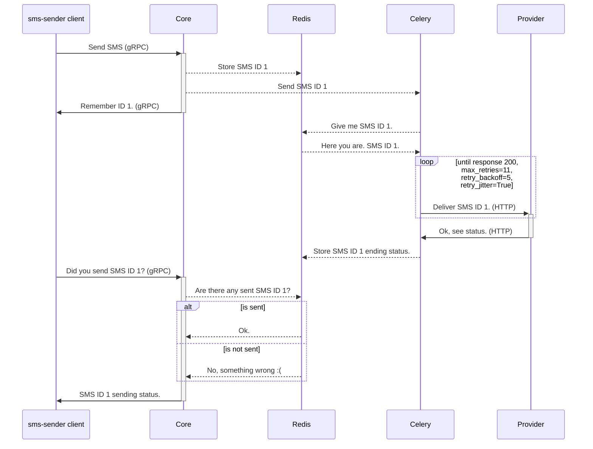
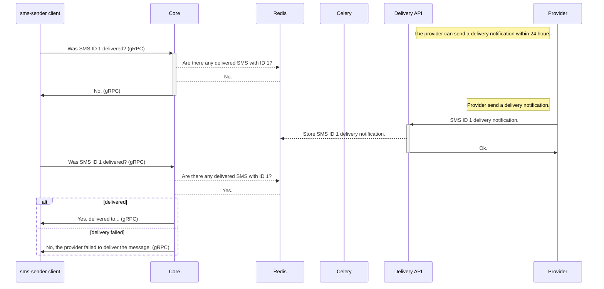

# sms-sender service
[MIT License](LICENSE.txt)

Microservice for sending SMS messages.

The project pursues educational and research goals. It can be the base of a real microservice. But I doubt that radis-om is ready for use in production at the moment.

# System Components


# Installation
```shell
git clone https://github.com/edelwi/sms-service.git
cd sms-service
# run service
docker-compose up --build  # build and run containers (console attached mode, add -d to detach)
```

# Run client
```shell
python3  -m venv venv
source ./venv/bin/activate  # activate virtual environment (on linux) on Windows run venv\Scripts\activate.bat
pip install grpcio==1.54.2 requests==2.31.0
python sms_client.py
```

# Interaction schemes

## SMS sending scheme


## SMS Delivery schema


